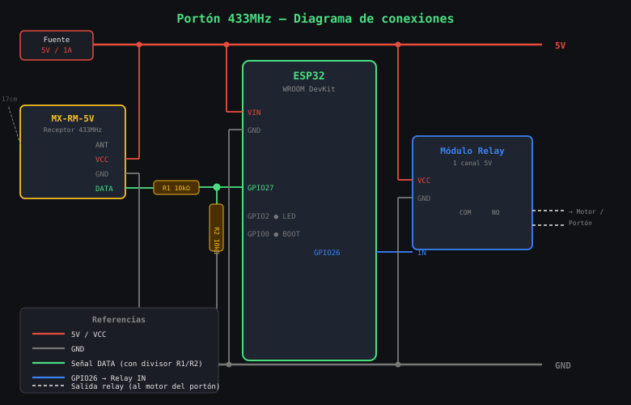

# Control de Portón 433MHz con ESP32

Sistema de control de acceso para portones y puertas mediante controles remotos 433MHz, con panel web protegido por login, relevador físico y registro de accesos.

---

## Características

- Aprende y registra controles remotos 433MHz
- Activa un relevador físico al recibir un código autorizado
- Bloquea controles individualmente sin borrarlos
- Registro automático de cada acceso (fecha, hora, nombre)
- Panel web con autenticación de usuarios admin
- Múltiples cuentas admin con gestión desde la web
- Red WiFi dual: AP propio + conexión a WiFi de casa simultáneos
- Sincronización de hora por NTP (cuando hay WiFi de casa)
- Factory reset por botón físico

---

## Hardware requerido

| Componente | Detalle |
|---|---|
| ESP32 DevKit | Cualquier variante con botón BOOT en GPIO 0 |
| Receptor 433MHz | **MX-RM-5V** (superheterodino, 5V) |
| Relevador (relay) | Módulo de 1 canal, 5V o 3.3V según tu módulo |
| LED azul | Integrado en GPIO 2 (ya incluido en la mayoría de DevKits) |
| RTC DS3231 | **Opcional** — mantiene hora sin internet ni batería de respaldo (incluye batería CR2032) |

### Pinout del MX-RM-5V

El módulo tiene 4 pines (de izquierda a derecha mirando la cara con componentes):

```
┌─────────────────────┐
│  ANT  VCC  GND  DATA│
└─────────────────────┘
```

| Pin MX-RM-5V | Conectar a |
|---|---|
| ANT | Antena (hilo de ~17.3 cm o resorte) |
| VCC | Pin **5V** del ESP32 DevKit |
| GND | GND del ESP32 |
| DATA | GPIO 27 del ESP32 (ver nota abajo) |

> **Importante — niveles de voltaje:** El MX-RM-5V opera a 5V y su pin DATA puede entregar hasta 5V. El ESP32 acepta en sus entradas un máximo de 3.3V en condiciones normales. Para proteger el ESP32 se recomienda un divisor de tensión entre DATA y GPIO 27:
>
> ```
> DATA (5V) ──[ 10kΩ ]──┬── GPIO 27
>                        │
>                      [ 20kΩ ]
>                        │
>                       GND
> ```
>
> En la práctica muchas instalaciones funcionan sin el divisor porque los pines del ESP32 toleran 5V en modo entrada, pero no está garantizado por el fabricante.

> **Antena:** para mayor alcance soldá un hilo rígido de **17.3 cm** al pin ANT (λ/4 a 433MHz).

### Diagrama de conexiones



> Si el diagrama no se ve, abrí [diagrama_conexiones.html](diagrama_conexiones.html) directamente en el navegador.

### Conexiones completas ESP32

| Señal | GPIO ESP32 |
|---|---|
| MX-RM-5V DATA (con divisor) | 27 |
| Relevador (IN) | 26 |
| LED de estado | 2 (integrado) |
| Botón factory reset | 0 (BOOT, integrado) |
| DS3231 SDA (opcional) | 21 (I2C por defecto) |
| DS3231 SCL (opcional) | 22 (I2C por defecto) |

> El DS3231 opera a 3.3V. Conectar VCC al pin 3.3V del ESP32 (no al 5V).

> Los pines se pueden cambiar modificando las constantes al inicio de `porton_433.ino`.

---

## Librerías necesarias (Arduino IDE)

Instalar desde el gestor de librerías (**Sketch → Incluir librería → Gestionar librerías**):

| Librería | Autor |
|---|---|
| **RCSwitch** | sui77 |
| **ArduinoJson** | Benoit Blanchon |
| **RTClib** | Adafruit (opcional, solo si usás el módulo DS3231) |

Las demás (`WiFi`, `WebServer`, `LittleFS`, `WiFiClientSecure`, `time.h`, `mbedtls/md5.h`) vienen incluidas en el core de ESP32.

> **Nota:** Si el IDE muestra errores en `mbedtls/md5.h` o `WiFiClientSecure.h`, son falsos positivos del IntelliSense. El código compila correctamente con el toolchain del ESP32.

---

## Configuración en el código

Al inicio de `porton_433.ino` están las constantes que podés modificar:

```cpp
#define RF_RX_PIN       27      // Pin DATA del receptor 433MHz
#define RELAY_PIN       26      // Pin de señal del relevador
#define RELAY_PULSE_MS  2000    // Tiempo que permanece activo el relevador (ms)
#define TZ_OFFSET_SEC   -10800  // Zona horaria: UTC-3 Argentina
```

---

## Primer uso

### 1. Cargar el sketch

1. Abrí `porton_433.ino` en Arduino IDE.
2. Seleccioná tu placa: **Herramientas → Placa → ESP32 Dev Module**.
3. Seleccioná el puerto COM correcto.
4. Cargá el sketch con el botón **Subir**.

### 2. Conectarse al portón

Al encender por primera vez el ESP32 crea su propia red WiFi:

- **SSID:** `Porton_Config`
- **Password:** `porton1234`

Conectate a esa red desde tu celular o PC y abrí el navegador en:

```
http://192.168.4.1
```

### 3. Login inicial

La primera vez se crea automáticamente un usuario admin:

- **Usuario:** `admin`
- **Password:** `admin1234`

> **Importante:** Cambiá estas credenciales inmediatamente desde **Admins → Cambiar mi password**.

---

## Panel web

### Pestaña — Registros

Historial de todos los accesos con fecha/hora, nombre y código del control.

- Accesos de controles **bloqueados** aparecen con badge rojo `BLOQUEADO`.
- **Actualizar** recarga el listado manualmente.
- **Descargar CSV** exporta el historial completo.
- **Borrar registros** elimina todo el historial.

### Pestaña — Controles

Lista todos los controles remotos registrados y permite gestionarlos.

**Aprender un control nuevo:**
1. Escribí un nombre (ej. `Usuario`, `Vecino`).
2. Presioná **Iniciar aprendizaje**.
3. Apretá una vez el botón del control remoto.
4. El código se guarda automáticamente.

**Bloquear / habilitar un control:**
- **Bloquear** impide el acceso sin eliminar el control. El relevador no se activará.
- **Habilitar** restaura el acceso.
- Los controles bloqueados se muestran con badge rojo.

**Borrar un control:**
- **Borrar** lo elimina definitivamente del sistema.

### Pestaña — Notificaciones Telegram

Configuración opcional para recibir mensajes en un grupo o chat de Telegram.

**Cómo configurarlo:**
1. Abrí Telegram y buscá **@BotFather**
2. Enviá `/newbot` y seguí los pasos para crear tu bot — te dará un **Token**
3. Agregá el bot al grupo donde querés recibir las notificaciones
4. Buscá **@userinfobot** en Telegram, reenviále un mensaje del grupo y te dará el **Chat ID** (número negativo para grupos, ej. `-1001234567890`)
5. En la pestaña **Red → Notificaciones Telegram** del panel web:
   - Activá el toggle
   - Pegá el Token y el Chat ID
   - Elegí qué eventos notificar
   - Guardá

**Eventos configurables:**

| Evento | Mensaje que llega |
|---|---|
| Acceso autorizado | `Acceso: Usuario - 2026-04-21 10:30:00` |
| Control bloqueado | `BLOQUEADO: Vecino - 2026-04-21 10:31:00` |
| Código desconocido | `Desconocido: codigo 123456 - 2026-04-21 10:32:00` |

> Requiere que el ESP32 esté conectado al WiFi de casa. Si no hay conexión, el portón sigue funcionando normalmente y simplemente no envía la notificación.

### Pestaña — Red

**Reloj RTC (DS3231):**
Si el módulo DS3231 está conectado, el panel muestra su estado (Conectado / No detectado) y la hora local actual. Desde aquí podés establecer la hora manualmente — ingresás la hora en tu zona horaria local y el sistema la convierte a UTC internamente.

Prioridad de sincronización:
1. Al arrancar: si el DS3231 tiene hora válida (año ≥ 2020) la carga al sistema.
2. Al conectar al WiFi de casa: NTP sincroniza y actualiza el DS3231.
3. Sin internet: el DS3231 mantiene la hora con su batería CR2032.
4. Sin DS3231 ni internet: la hora se muestra como `uptime+Xs`.

**Zona horaria:**
Selector de zona horaria con predeterminado México Centro (UTC-6). Se aplica al instante sin reiniciar. Opciones disponibles: México (tres zonas), países de América Latina, España y UTC.

> La zona se guarda en `/tz.json`. NTP obtiene la hora en UTC y el ESP32 la convierte localmente usando la zona configurada.

**AP del portón:**
Cambia el SSID y contraseña de la red WiFi propia del dispositivo.
- Password mínimo 8 caracteres. Dejarlo vacío para red abierta.
- El dispositivo se reinicia al guardar.

**WiFi de casa:**
Conecta el ESP32 a tu red doméstica para:
- Tener hora real en los registros (sincronización NTP automática).
- Acceder al panel desde cualquier dispositivo de tu red local.
- El AP propio sigue funcionando en simultáneo.

### Pestaña — Admins

**Usuarios admin:** lista todos los usuarios con acceso al panel.
- No se puede borrar el último admin que queda.

**Agregar admin:** crea un nuevo usuario con password propio (mínimo 6 caracteres).

**Cambiar mi password:** cambia la contraseña del usuario actualmente logueado.
- Requiere ingresar el password actual para confirmar.

---

## Relevador (relay)

El relevador se activa por **2 segundos** cada vez que se recibe un código registrado y no bloqueado.

| Situación | Relevador | Log |
|---|---|---|
| Control registrado y habilitado | Se activa 2 seg | Acceso normal |
| Control registrado y bloqueado | No se activa | `BLOQUEADO` en rojo |
| Código desconocido | No se activa | `Desconocido` |

El tiempo de pulso se ajusta con `RELAY_PULSE_MS` (milisegundos) en el código.

---

## Factory Reset

Si olvidás el password del AP y no podés conectarte al panel:

1. Mantené apretado el botón **BOOT** de la placa por **5 segundos**.
2. El LED azul parpadea con frecuencia creciente mientras contás.
3. Al completar los 5 segundos el ESP32 reinicia con los valores por defecto:
   - **SSID:** `Porton_Config`
   - **Password:** `porton1234`

> Los registros, controles aprendidos y usuarios admin **NO se borran** con el factory reset. Solo se resetea la configuración del AP.

---

## Archivos en flash (LittleFS)

| Archivo | Contenido |
|---|---|
| `/users.json` | Controles remotos (código, nombre, estado bloqueado) |
| `/logs.json` | Historial de accesos (máximo 500 entradas) |
| `/admins.json` | Usuarios admin con password hasheado |
| `/wifi.json` | Credenciales del WiFi de casa |
| `/ap.json` | Configuración del AP propio |
| `/tz.json` | Zona horaria (cadena POSIX, ej. `<-06>6`) |

---

## Seguridad

- El panel requiere login con sesión por cookie (duración 1 hora).
- Los passwords se almacenan como hash MD5, nunca en texto plano.
- Las sesiones viven solo en RAM; al reiniciar el ESP32 se cierran todas.
- Máximo 5 sesiones simultáneas y 10 usuarios admin.
- No usa HTTPS (limitación de hardware). Se recomienda usar en red local de confianza.

---

## Diagrama de flujo — detección RF

```
Señal 433MHz recibida
        │
        ▼
  ¿Modo aprendizaje activo?
   ├── Sí → Guarda código con el nombre ingresado. Fin.
   └── No
        │
        ▼
  ¿Código registrado?
   ├── No → Log "Desconocido", relevador inactivo. Fin.
   └── Sí
        │
        ▼
  ¿Control bloqueado?
   ├── Sí → Log "BLOQUEADO", relevador inactivo. Fin.
   └── No → Activa relevador 2 segundos + Log acceso. Fin.
```
